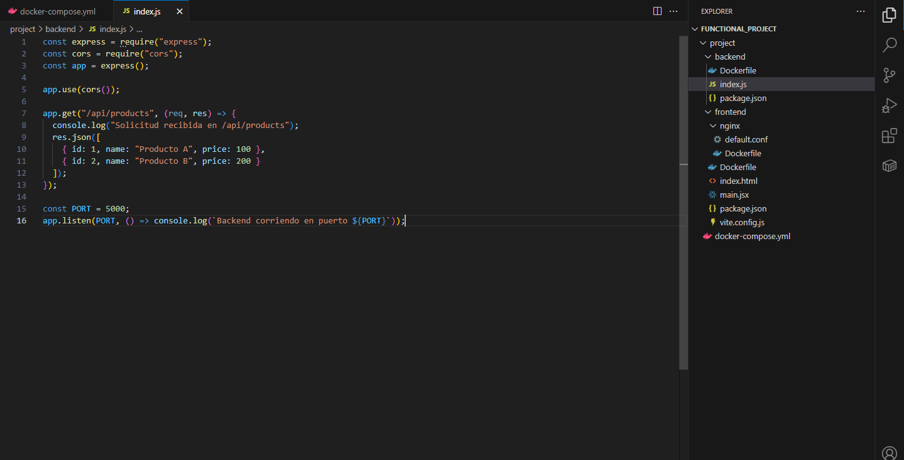
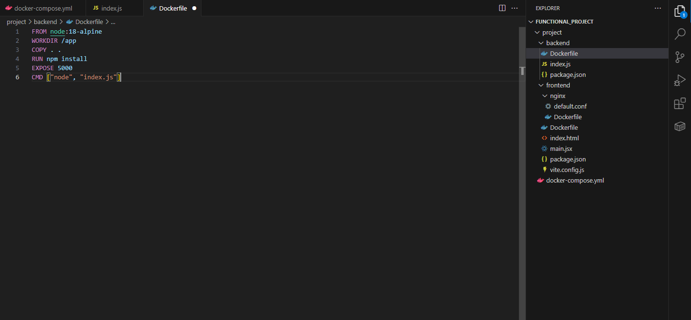
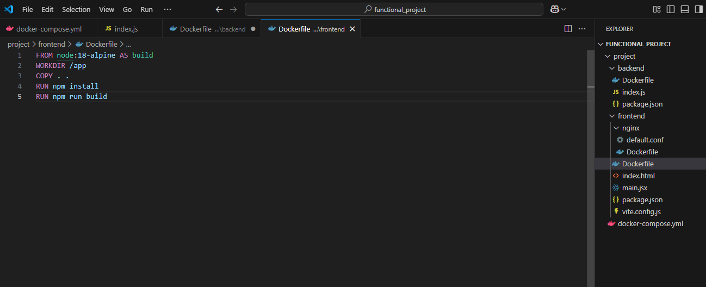
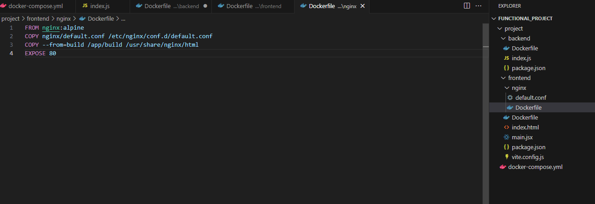
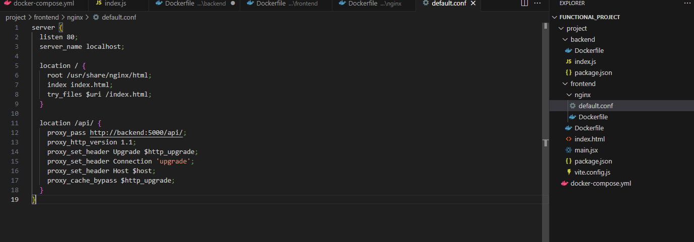
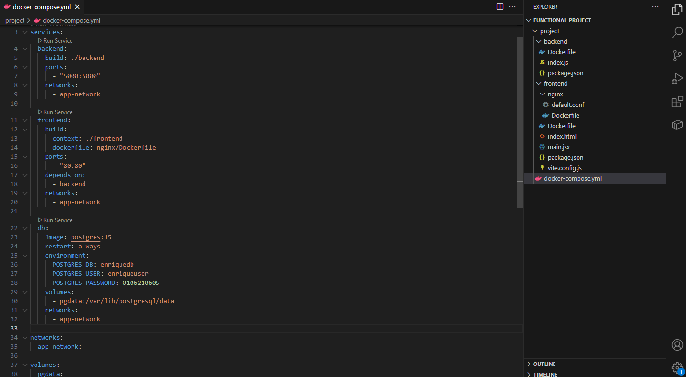
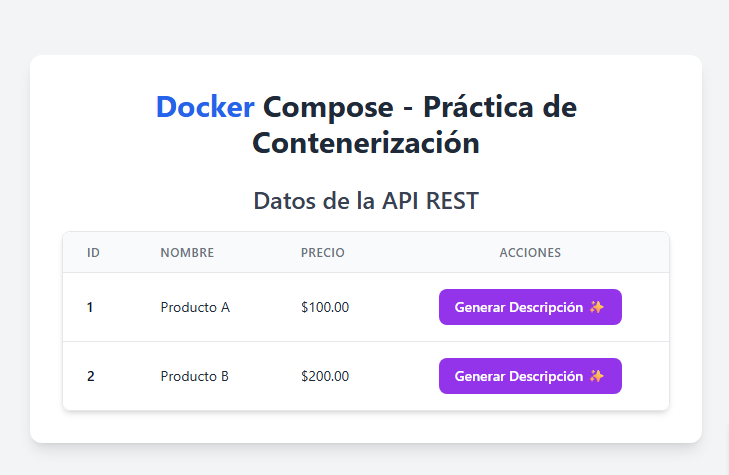

# Práctica: Contenerización de Aplicación React y Backend con Docker

## 1. Título  
**Contenerización de aplicación React y backend con Docker para visualización de datos mediante API REST**

## 2. Tiempo de duración  
**90 minutos**

## 3. Fundamentos  

Esta práctica tiene como objetivo contenerizar una aplicación frontend desarrollada con React y un backend construido con Node.js. El frontend consulta los datos desde una API REST proporcionada por el backend, y ambos servicios se ejecutan en contenedores Docker. Se crean imágenes personalizadas para frontend y backend, se utiliza un contenedor de Nginx para servir la versión de producción del frontend y se incluye una base de datos PostgreSQL. Finalmente, se utiliza `docker-compose` para orquestar todos los servicios, garantizando su correcta comunicación dentro de una red compartida.

## 4. Conocimientos previos

- Fundamentos de Docker y `docker-compose`.
- Conocimientos básicos de React.
- Entendimiento básico de APIs REST con Node.js.
- Manejo de terminal y comandos Docker.
- Fundamentos de Nginx como servidor de archivos estáticos.

## 5. Objetivos a alcanzar

- Construir una API REST funcional en Node.js.
- Construir una aplicación React funcional que consuma dicha API.
- Contenerizar el backend y el frontend.
- Servir los archivos estáticos del frontend con Nginx en modo producción.
- Integrar todos los servicios (frontend, backend y base de datos) usando `docker-compose`.

## 6. Equipo necesario

- Docker y `docker-compose` instalados.
- Node.js y npm.
- Editor de código (Visual Studio Code recomendado).
- Navegador web moderno.
- Conexión a internet para descarga de imágenes base.

## 7. Material de apoyo

- [Docker Docs](https://docs.docker.com/)
- [React Docs](https://reactjs.org/docs/getting-started.html)
- [Node.js Docs](https://nodejs.org/en/docs/)
- [Nginx Docs](https://nginx.org/en/docs/)

## 8. Procedimiento

### Paso 1: Crear proyecto backend

**Archivo:** `backend/index.js`
```js
const express = require("express");
const cors = require("cors");
const app = express();

app.use(cors());

app.get("/api/products", (req, res) => {
  console.log("Solicitud recibida en /api/products");
  res.json([
    { id: 1, name: "Producto A", price: 100 },
    { id: 2, name: "Producto B", price: 200 }
  ]);
});

const PORT = 5000;
app.listen(PORT, () => console.log(`Backend corriendo en puerto ${PORT}`));
```
- 
  
### Paso 2: Dockerfile para backend

```Dockerfile
FROM node:18-alpine
WORKDIR /app
COPY . .
RUN npm install
EXPOSE 5000
CMD ["node", "index.js"]

```
- 

### Paso 3: Crear proyecto frontend

```bash
npx create-react-app frontend
```

### Paso 4: Dockerfile para build de frontend

```Dockerfile
FROM node:18-alpine AS build
WORKDIR /app
COPY . .
RUN npm install
RUN npm run build

```
- 
- 
### Paso 5: Dockerfile para servir frontend con Nginx

```Dockerfile
FROM nginx:alpine
COPY nginx/default.conf /etc/nginx/conf.d/default.conf
COPY --from=build /app/build /usr/share/nginx/html
EXPOSE 80
```
- 

### Paso 6: Configuración de Nginx

```nginx
server {
  listen 80;
  server_name localhost;

  location / {
    root /usr/share/nginx/html;
    index index.html;
    try_files $uri /index.html;
  }

  location /api/ {
    proxy_pass http://backend:5000/api/;
    proxy_http_version 1.1;
    proxy_set_header Upgrade $http_upgrade;
    proxy_set_header Connection 'upgrade';
    proxy_set_header Host $host;
    proxy_cache_bypass $http_upgrade;
  }
}
```
- 

### Paso 7: Crear `docker-compose.yml`

```yaml
version: '3.8'

services:
  backend:
    build: ./backend
    ports:
      - "5000:5000"
    networks:
      - app-network

  frontend:
    build:
      context: ./frontend
      dockerfile: nginx/Dockerfile
    ports:
      - "80:80"
    depends_on:
      - backend
    networks:
      - app-network

  db:
    image: postgres:15
    restart: always
    environment:
      POSTGRES_DB: enriquedb
      POSTGRES_USER: enriqueuser
      POSTGRES_PASSWORD: 0106210605
    volumes:
      - pgdata:/var/lib/postgresql/data
    networks:
      - app-network

networks:
  app-network:

volumes:
  pgdata:

```
- 
- 
## 9. Resultados esperados

- El backend responde en el puerto 5000 con los datos de la API `/api/products`.
- El frontend está disponible en [http://localhost](http://localhost) y muestra la tabla con los datos obtenidos del backend.
- El contenedor de Nginx sirve los archivos estáticos construidos desde React (`npm run build`).
- Todos los servicios se comunican correctamente mediante Docker Compose.

### Capturas de pantalla del resultado

- 


## 10. Bibliografía

- [Docker Docs](https://docs.docker.com/)
- [React Official Docs](https://reactjs.org/)
- [Node.js Docs](https://nodejs.org/)
- [Nginx Docs](https://nginx.org/en/docs/)

## 11. Audio

🔊 [Escuchar audio explicativo](https://drive.google.com/file/d/1QzVRQqNuw4O00jsfBeXqzr8cwFVuwQfy/view?usp=sharing)
